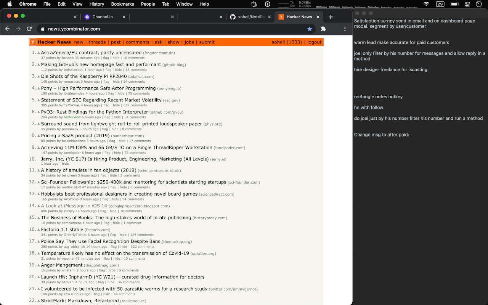

# NoteTop

NoteTop is a basic todo app for MacOS. It always stays on top of other windows (floating) and can be used with [Rectangle window manager](https://github.com/rxhanson/Rectangle) (see [Todo Mode in Rectangle](https://twitter.com/patrickc/status/1351650517869465601).)

## Installation

Build the app with XCode and move to your `/Applications` dir. A binary release may be provided in the future, or maybe you can send a PR.

## Usage

Clicking on the MenuBar icon will show/hide the app. A global hotkey would be a nice addition, it may be added in the future.

## Contributing
Pull requests are welcome. For major changes, please open an issue first to discuss what you would like to change.

## License
[MIT](https://choosealicense.com/licenses/mit/)
